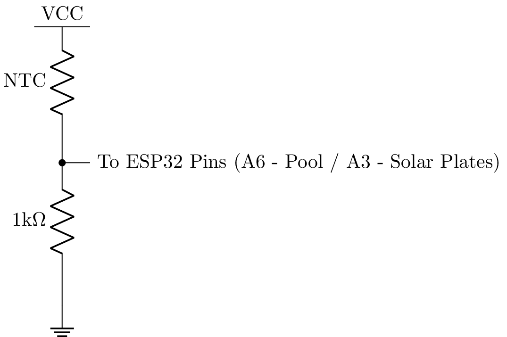
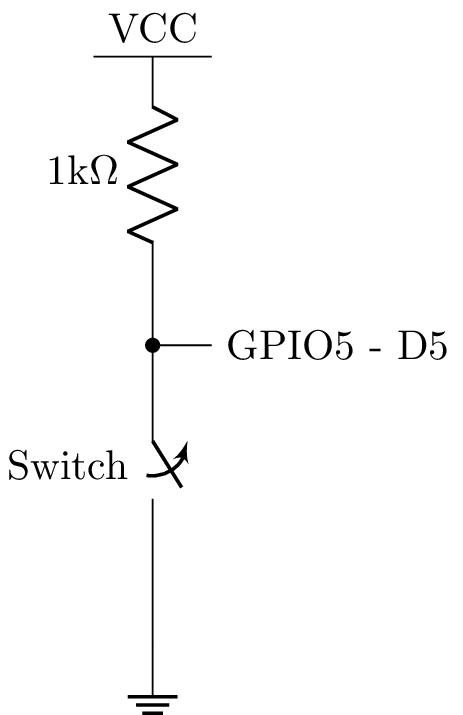

# CasaMaquinas
This project manages a swimming pool machine room with several features. It works with Esp32 and RainMaker framework.

# Switch Features
Remembering that activation is done with logic level 0. Deactivation is done with logic level 1 as per the reles modules.
All Switch features appear as switches in the RainMaker App.

## Filtering pump 
#### Activates GPIO 16 (RX2)
Manages the pool main pump.  

## LEDs
#### Activates GPIO 17 (TX2)
Manages pool ilumination. 

## Drain Pump
#### Activates GPIO 18 (D18)
Manages a small pump to drain the whole where the pump main pump is placed. For the case where yout main pump is under ground level. It works together with a level sensor.  

## Warming Pump
#### Activates GPIO 4 (D4)
Manages the pump that pumps water to the solar warming system. It works together with atwo NTC sensors. One is placed in the return path, and the other is placed in the solar plates. In the RainMaker app, it will appear as a thermostat and the user will be abçe to select the pool's temperatures. The firmware will then control this pump properly. If the set desired temperature is lower than the solar plates temperature, then this pump will be activated. Otherwise, it will deactivate.

## Cupper Ionizer
#### Activates GPIO 19
Manages the Cupper ionizer.

# Temperature Sensor Features
All temperature sensor features appear as temperature sensors in the RainMaker App.
### Characteristics
Both sensors are NTCs of 10kOhm @ 25 degrees Celsius. Beta factor is 3950. They are conected as per the below figure.

#### Solar Plates NTC
It is placed in the solar plates. In the ESP32 board, it is connected in pin ADC1, channel 3. In the RainMaker app, it appears as a temperatures sensor. 
#### Pool NTC
It is placed in the pool's return path. In the ESP32 board, it is connected in pin ADC1, channel 3.

# Level Sensor Features
The level sensor is a reed switch and does not appear in the RainMaker App. Instead, there is a logic in the code to activate the Drain Pump every time this sensor is activated. In the RainMaker App, the Drain Pump Switch will show status on. The sensor is connected as per figure below:

